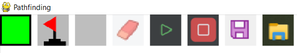
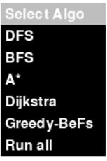
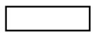
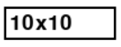

# Pathfinding_Project

## Introduction
**Pathfinding_Project** is a Python application that demonstrates various pathfinding algorithms. Users can visualize the algorithms, as well as create and test custom maps.

## Information

This project uses [benchmark maps](maps) from **Moving AI Lab**.

For further information please visit: https://www.movingai.com/benchmarks/grids.html

Maze-Benchmarks used in this project: https://www.movingai.com/benchmarks/maze/index.html

```bibtex
@article{sturtevant2012benchmarks,
  title={Benchmarks for Grid-Based Pathfinding},
  author={Sturtevant, N.},
  journal={Transactions on Computational Intelligence and AI in Games},
  volume={4},
  number={2},
  pages={144 -- 148},
  year={2012},
  url = {http://web.cs.du.edu/~sturtevant/papers/benchmarks.pdf},
}
```

## Getting started

Before running the program, make sure to install the required packages by running:
```cmd
pip install -r requirements.txt
```
To start the application run:
```cmd
python main.py
```

## Application Overview

### Toolbar


Starting from the left:
* **Start_Cube**: Set the start point on the grid
* **Goal_Cube**: Set the end point on the grid
* **Obstacle**: Set walls that the pathfinding algorithm must navigate around
* **Eraser**: Resets cubes to default
* **Play / Run algorithm**: Executes the selected algorithm (only works if Start_Cube and Goal_Cube are set)
* **Stop**: Clears path and visited cubes from the algorithm
* **Save**: Saves the current map configuration
* **Import**: Opens the file explorer to select a map to import

### Dropdown


Click on the dropdown to select an algorithm



Starting from top to bottom:
* **DFS**
* **BFS**
* **A***
* **Dijkstra**
* **Greedy-BeFs**
* **Run all**: Executes all algorithms listed above

### Input_field



Click on the input field to active it and enter the desired grid dimensions (e.g `rows x cols`)



### Toggle_Buttons


* **Trace-Memory**: Enables memory tracing
* **10x**: Runs the selected algorithm ten times
* **All maps**: Loops through all maps in the [maps directory](maps)

## Results

### Overview
The results presented in the [table](results/results.csv) represent the average values obtained from 10 independent runs of each algorithm on a specific map configuration.
This method reduces variance, leading to more reliable and robust results.

### Test Environment
All tests were conducted on the following setup:
```
CPU: Intel(R) Core(TM) i5-4690 CPU @ 3.50GHz (4 cores, 4 threads)
RAM: 16 GB DDR3 @ 1333 MHz
```

## Post Data Collection - optional
After collecting your data, you can proceed with analysis and visualization.

* **1 - Install Required Packages**: Make sure you have all the necessary Python packages installed by running:
    ```cmd
    pip install -r utils/requirements.txt
    ```
* **2 - Merge Data Tables**: If you have run the algorithm with and without memory-tracing enabled, you can merge the results. 
The merged data will be saved in `results/results.csv`. To merge the tables execute:
    ```cmd
    python utils/merge-csv-results.py
    ```
* **3 - Visualize Map Data**: To visualize the data for a specific map run:
    ```cmd
    python utils/visualize-certain-map-results.py
    ```
    A file explorer window will open, allowing you to select a map.
    Choose a map for which data is available to generate the visualization.